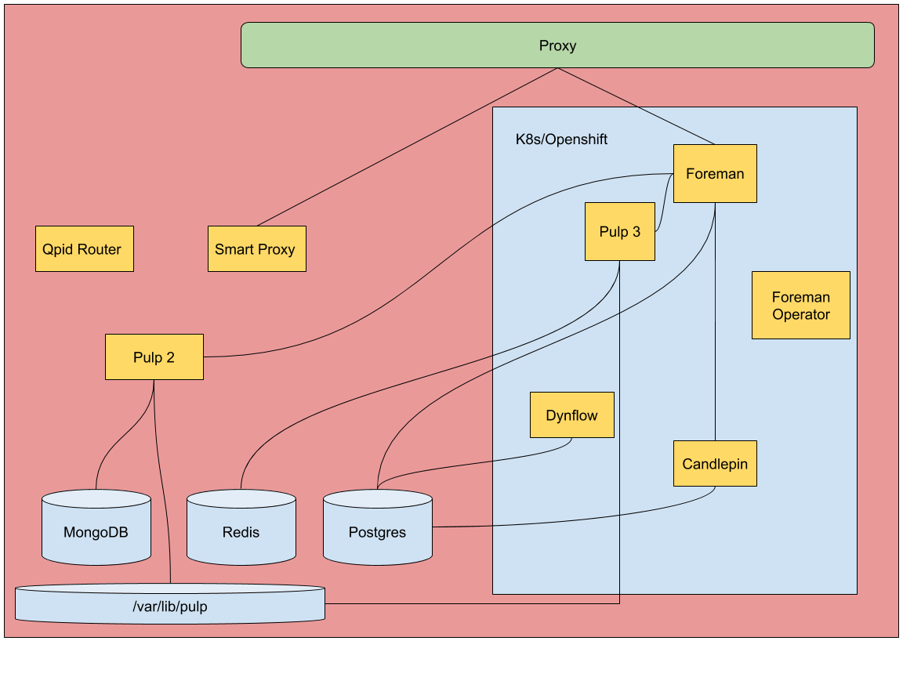

# Deployment and Architecture

The deployment of a containerized architecture inside Kubernetes requires supporting a transitional approach to more closely match upgrades to and allow targeted movement of services into a container based deployment.

The goal is to enable a platform with core services and the ability to bring secondary services online along with any requires backend services in a modular way. This implies an ability to be able to package secondary services independently for deployment. This leads to the following deployment goals:

 * Ability to deploy core service(s) with customization
 * Ability to deploy secondary services independently
 * Ability to deploy to a cluster with a minimal cluster permission set
 * Ability to deploy to Kubernetes and community Kubernetes distributions
 * Ability to deploy to external Kubernetes
 * Support all-in-one deployments

### Design

The design is to use an [Operator](https://coreos.com/operators/) to manage the state of an instance of Foreman running on Kubernetes. The Operator would be based upon the [ansible-operator](https://github.com/water-hole/ansible-operator) allowing the capture of deployment and remediation tasks in Ansible code. The Operator will use a Custom Resource Definition (CRD) to define what a Foreman deployment will look like. Likely, other operators will be used for managing dependent services of sufficient complexity (e.g. Pulp or Smart proxy). For example, with a warning that this layout is proposed at present, you may want a Foreman server with Katello and Remote Execution and two dynflow workers:

```
apiVersion: app.theforeman.org/v1alpha1
kind: Foreman
metadata:
  name: "myforeman"
  namespace: foreman
spec:
  dynflow_workers: 2
  plugins:
    katello: true
    remote_execution: true
```

#### Architecture

The architecture proposal is designed to match the upgrade scenario in order to support a stepped approach to introducing containerized services and provide parity with existing deployments, see [Upgrades](./upgrades.md) for what that upgrade process looks like. This architecture relies on putting services into a Kubernetes environment targeting stateless services at the outset. The databases would begin by living outside of the Kubernetes environment with an option to run them inside Kubernetes.

The base deployment would put a Kubernetes on the same box as all services to provide the single box experience as the base case for users. Optionally, services could be deployed to an existing Kubernetes environment and connected back to a host(s) running databases.



### Deployment Testing

The deployment strategy reflects how to handle changes to the deployment code to ensure that changes do not break existing builds.

**On PRs to change foreman.yml or deploy/ directory**

 * Run a deployment test
 * Run smoke tests
